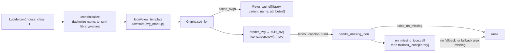

# Components: the kit, `Icon`, and `svg_for`

The render path. Files: `lib/glyphs.rb` (122 lines), `lib/glyphs/icon.rb` (35),
`lib/glyphs/configuration.rb` (35), the thirteen `lib/glyphs/*_icon.rb`
subclasses (7 lines each), `lib/glyphs/icon_reference.rb` (91),
`lib/glyphs/railtie.rb` (12).

## The flow

## Loading

`lib/glyphs.rb:8-18` sets up a `Zeitwerk::Loader.for_gem` and ignores five
paths: `glyphs/version.rb`, `glyphs/rubocop.rb`, `lib/rubocop`,
`glyphs/railtie.rb` and `lib/tasks`. The Railtie is required conditionally
(`lib/glyphs.rb:21`, `if defined?(Rails::Railtie)`) and does one thing —
`rake_tasks { load .../tasks/glyphs.rake }` (`lib/glyphs/railtie.rb:7-11`). It is
a Railtie, not an Engine: the gem contributes no routes, views or migrations.
`lib/glyphs.rb:26` calls `Icons.config` so the icons gem is configured outside
Rails too; inside Rails, `rails_icons`' engine has already set
`Icons.config.base_path = Rails.root`, and the icons configuration is memoized,
so this never clobbers it. The bottom of the file
(`Glyphs.autoload :RuboCop, …`, line 122) makes `Glyphs::RuboCop::Plugin`
resolvable whenever RuboCop constantizes it from the gemspec metadata, which can
be long after the gem was required.

## `Icon` (`lib/glyphs/icon.rb:8-34`)

`initialize` (11-23) raises `ArgumentError, "library is required — use a library
component (LucideIcon, HeroIcon, ...) or pass library:"` when the resolved
library is nil, which is exactly the base class used directly (`LIBRARY = nil`,
line 9). It then dasherizes the name, symbolizes library and variant, and keeps
every other keyword in `@attributes` — those are forwarded to the icons gem as
`arguments:` and end up on the `<svg>` tag. `view_template` (25-27) is
`raw safe(svg_markup)`: the markup is a trusted file on disk, not user input.

The thirteen subclasses are generated by hand, one file each, whose entire body
is `LIBRARY = :<library>`. They are listed in
`IconReference::LIBRARY_TO_COMPONENT` (`icon_reference.rb:22-36`) — the canonical
map, which `RuboCop::Cop::Glyphs::LibraryCallHelpers` re-keys by string
(`library_call_helpers.rb:15`) so the cops and the pruner cannot drift. Adding a
library means adding *both* a subclass file and a `LIBRARY_TO_COMPONENT` row; a
library the icons gem gains upstream gets no component until someone does, or
until an app calls `Glyphs.register_library`.

## `Glyphs.svg_for` (`lib/glyphs.rb:76-83`) and the cache

The cache is a plain Hash guarded by `@svg_cache_mutex` (lines 35-36), keyed by
`[library, variant, name, attributes]` — attributes included, so
`LucideIcon(:house, class: "size-4")` and `size-6` do not collide. When
`configuration.cache_svgs` is false the method returns before touching the cache
at all, so the uncached path never populates it. `reset_cache!` (85-87) clears
it; nothing clears it automatically, so anything that changes what a name
resolves to (reconfiguring `Icons.config`, swapping a fixture tree in a spec)
must call it. `spec/spec_helper.rb` does, in a global `before`.

The fallback is rendered *under the original key*: `svg_for` computes the key
from the requested name, and `handle_missing_icon` only supplies a different
name to `build_svg`. With caching on, that means `on_missing_icon` fires once
per process per missing `[library, variant, name, attributes]`, not on every
render — the trade documented in `README.md`.

## The missing-icon policy (`lib/glyphs.rb:101-114`)

`handle_missing_icon` runs in this order and can raise at two points:

1. `raise error if configuration.raise_on_missing` — the default is
   `defined?(Rails) ? Rails.env.local? : true`, evaluated once in
   `Configuration#initialize` (`configuration.rb:27`).
2. `configuration.on_missing_icon&.call(error, name:, library:, variant:)` —
   note the hook receives the *requested* name and gets no say in the outcome.
3. `fallback = configuration.fallback_icons[library.to_sym]`; `raise error` when
   there is none. Only `lucide`, `phosphor` and `heroicons` have one by default
   (`Configuration::DEFAULT_FALLBACK_ICONS`, `configuration.rb:5-9`).
4. The fallback is rendered at the *same variant and attributes* as the original
   request. If that file is also missing, the rescue at line 111 re-raises the
   original `Icons::IconNotFound`, not the fallback's.

Every error in this path is `Icons::IconNotFound` from the icons gem; this gem
defines no exception class of its own except
`Glyphs::PruneRunner::VerificationError`.

## `Glyphs.register_library` (`lib/glyphs.rb:58-72`)

Defines an anonymous `Icon` subclass with `LIBRARY = <library>` and `const_set`s
it under `Glyphs`, which makes it a kit method. It is idempotent for the same
pair — an existing constant that is an `Icon` subclass with a matching `LIBRARY`
is returned unchanged — and raises `ArgumentError` when the constant exists but
renders a different library. It registers no SVG location: where the files live
is the icons/rails_icons custom-library configuration's business.

## Configuration (`lib/glyphs/configuration.rb`)

Six accessors, all plain: `raise_on_missing`, `on_missing_icon`,
`fallback_icons`, `cache_svgs`, `keep_icons`, `prune_source_globs`. Defaults are
set in `initialize` (26-33). `Glyphs.configure` yields the memoized instance and
returns it; `Glyphs.reset_configuration!` replaces it. The last two accessors
belong to the pruner (`../pruning/summary.md`) and are read only at prune time.
