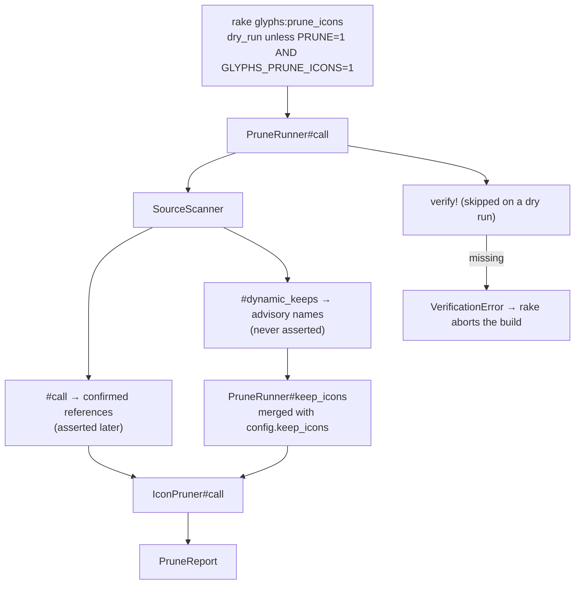

# Pruning: scan → prune → verify

`bin/rails glyphs:prune_icons` deletes synced SVGs nothing can reference, so a
Docker image ships a handful of icons instead of the ~1745 lucide files
`rails g rails_icons:sync` copies in. Files: `lib/glyphs/source_scanner.rb`
(396 lines), `lib/glyphs/icon_pruner.rb` (131), `lib/glyphs/prune_runner.rb`
(136), `lib/glyphs/prune_report.rb` (61), `lib/tasks/glyphs.rake` (17).

## The two-env-var gate

`lib/tasks/glyphs.rake:6` — `commit = ENV["PRUNE"] == "1" && ENV["GLYPHS_PRUNE_ICONS"] == "1"`.
Both, exactly `"1"`, or the run is a dry run that deletes nothing and prints
`Re-run with PRUNE=1 GLYPHS_PRUNE_ICONS=1 to delete.`
(`prune_report.rb:26`). The task rescues only `PruneRunner::VerificationError`,
`warn`s its message and `abort`s with
`[glyphs:prune_icons] prune verification failed — aborting.`

## `SourceScanner` — what counts as a reference

`#call` (56-59) and `#dynamic_keeps` (67-70) both trigger the single memoized
`#scan` (74-83), which walks Ruby files with Prism and template files with
regexes. `template_files - ruby_files` (line 80) means a path matched by both
glob sets is scanned as Ruby only.

| Glob set | Default | How it is read |
|---|---|---|
| `DEFAULT_RUBY_GLOBS` | `app/**/*.rb`, `lib/**/*.rb` | Prism AST (`CallVisitor`) |
| `DEFAULT_TEMPLATE_GLOBS` | `app/**/*.erb`, `app/**/*.haml`, `app/**/*.slim` | `TEMPLATE_CALL_PATTERN` + `ICONIFY_PATTERN` |
| `extra_globs` | `config.prune_source_globs` (nil ⇒ none) | same as templates — **added** to the template set, never replacing either default |

The AST visitor (`CallVisitor`, 201-394) records a reference only for a
receiverless call whose method is one of the thirteen components, one of the five
legacy helpers, or `Icon`/`icon` with a literal `library:`/`from:`. A literal
`variant:` is honoured; a *dynamic* variant returns the sentinel `:dynamic` and
the call is skipped entirely (`variant_for`, 299-307). Absent `variant:` means
the library's default (`IconReference.default_variant_for`).

`iconify` strings are picked up in both Ruby (`visit_string_node`, 228-235) and
templates (`scan_iconify`, 148-153), but `IconReference::ICONIFY_PATTERN`
(`icon_reference.rb:48`) matches only `lucide`, `phosphor` and `heroicons` — an
`iconify tabler--home` class is invisible to the scan.

### Dynamic harvesting

A call whose first argument is present but not a literal flags its library as
"dynamic" (`record_component`, 270-284) rather than recording a name.
`DynamicHarvest` (172-198) then supplies candidate names from two pools:

- **file-scoped** — every icon-name-shaped literal in a file that dynamically
  renders library L, contributed to L. `ICON_NAME_LITERAL` is
  `/\A[a-z][a-z0-9_-]*\z/` (line 206), so CSS classes with spaces or slashes and
  interpolated strings never qualify.
- **declaration-based** — literals under a hash key matching `/icon/i`
  (`visit_assoc_node`, 251-255) or a constant whose name matches `/ICON/i`
  (`visit_constant_write_node`, 244-247), contributed to *every* dynamically
  rendered library. `collect_declaration` (352-362) walks arrays and hash values
  and `unwrap_declaration_wrappers` (366-386) peels zero-arg `.freeze` and
  parentheses first, so `ICONS = { … }.freeze` still harvests.

A library rendered only with literals gets no dynamic keeps at all, so
declaration literals do not leak into it (`DynamicHarvest#to_h`, 193-197, keys
off `@dynamic_libraries`). Harvested names carry no variant; the pruner applies
them to every variant of that library.

### Failure handling

`scan_ruby` (99-106) and `scan_template` (108-116) rescue `StandardError`, warn
`[Glyphs::SourceScanner] skipped <path>: <class>: <message>` and continue. That
rescue covers I/O and visitor errors — **not Ruby syntax errors**:
`Prism.parse_file` does not raise on a broken file, it returns a partial AST
(`spec/fixtures/source/app/broken.rb` produces four Prism errors and no warning),
so a half-parsed file silently contributes whatever parsed.

## `IconPruner` — what gets deleted

`svg_files` (56-58) globs exactly two depths under `icons_root`:
`*/*/*.svg` (library/variant/name) and `*/*.svg` (library/name). Anything
deeper, and every non-`.svg` file, is invisible and therefore safe.
`grouped_files` (52-54) drops the `animated` library outright — its SVGs ship
inside the icons gem, not the app.

Per `[library, variant]` group:

1. **Wipe guard** — `library_used?` (122-129) requires library-specific
   evidence: a scanned reference, a configured fallback, or a *non-empty
   per-library* `keep_icons` entry. A flat `keep_icons` array is deliberately not
   evidence; counting it would let an entirely unreferenced library be wiped down
   to whatever the flat list happened to match. Without evidence the group is
   skipped with a warning and nothing in it is deleted.
2. **Keep set** — `keep_names_for` (100-109): references matching this exact
   library *and* variant, plus `keep_icons_for(library)`, plus
   `@fallback_icons[library]`. Note the asymmetry: `keep_icons_for` (111-116)
   looks up both the symbol and the string key, while the fallback lookup is
   symbol-only, so `fallback_icons` written with string keys is not honoured
   here.
3. **Delete** — `keep_file?` (93-95) is `pattern == name || File.fnmatch?(pattern, name)`,
   so every keep entry is also a glob. Everything else is counted, its size
   added to `bytes_freed`, and `File.delete`d unless `@dry_run`.

## `PruneRunner` — wiring and the safety net

`default_root` is `Rails.root.to_s` under Rails else `Dir.pwd` (127-129);
`default_icons_root` is `Icons.config.base_path` joined with
`Icons.config.icons_path` (131-134), which under rails_icons is
`Rails.root/app/assets/svg/icons`.

`#keep_icons` (71-79) passes the configured value straight through when there
are no dynamic keeps — the pruner accepts a flat list or a hash either way.
Otherwise everything folds into a per-library hash and a flat configured list is
applied to every library that has dynamic keeps (`merge_configured_keeps`,
83-91). A flat list therefore reaches *only* the dynamically rendered libraries
once any harvest happened.

`#verify!` (33-40) runs **after** the deletions, not before: `#call` (25-29) is
`report = pruner.call; verify! unless @dry_run`. It asserts `expected_files`
(103-112) — confirmed references plus configured fallbacks, filtered to
libraries that have a directory under `icons_root` (`library_present?`, 114-116) —
and raises `VerificationError` naming the first ten misses. Advisory keeps
(`keep_icons` globs, dynamic harvests) are deliberately **not** asserted: they
may legitimately match nothing.

One consequence of the filter: a fallback configured for a library the app never
synced cannot fail the build. One consequence of the *lack* of a filter:
`expected_files` builds its path from `reference.variant` verbatim, and
`IconReference.default_variant_for(:animated)` returns the string
`{css: "size-6", data: {}}` — the icons gem's animated options hash passed
through `normalize_variant#to_s`, not the `nil` every other variant-less library
resolves to. Nothing reaches that path today: `grouped_files` drops `animated`
before a keep set is computed, and `library_present?(:animated)` is false unless
the app has an `app/assets/svg/icons/animated` directory, which a gem-bundled
animated set does not create.

## `PruneReport`

A value object (`prune_report.rb:6-60`): `LibraryStat` rows (`Data.define`),
`deleted_count` / `kept_count` / `bytes_freed` sums, and a `to_s` of a headline
(`[dry-run] Would prune N icons, kept M, freed X` vs `Pruned …`), one sorted line
per `library/variant` (with `.` standing in for no variant), and a sample of at
most `SAMPLE_LIMIT = 20` deleted names.
